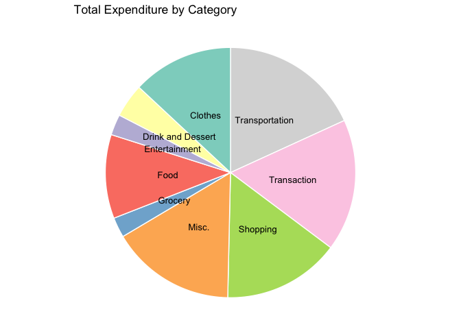

<!-- README.md is generated from README.Rmd. Please edit that file -->

# perfi

<!-- badges: start -->

[](https://github.com/ssonghaophie/perfi/actions/workflows/R-CMD-check.yaml)
[](https://app.codecov.io/gh/ssonghaophie/perfi?branch=main)

<!-- badges: end -->

### Overview

Perfi is a personal finance R package that provides a suite of tools for
importing, cleaning, analyzing, and visualizing personal finance
transaction data from different sources like Bank of America and US Bank
accounts. More specifically, Perfi features functions which allows users
to import and clean their bank transactions, visualize expenditure
distribution, budget their income, calculate average spending and
summarize their personal finance statistics. The package currently
contains dependencies on dplyr, utils, RColorBrewer, graphics and
ggplot2.

### Target Audience

This package was developed with the goal of simplifying personal finance
analysis for individuals of all backgrounds. Whether you’re a seasoned
financial analyst or someone new to managing finances, our aim is to
provide an accessible and intuitive tool for analyzing bank statements.
Our package offers a user-friendly interface and actionable insights to
help users gain a comprehensive understanding of their financial
situation.

### Installation

You can install the development version of perfi from
[GitHub](https://github.com/) with:

``` r
# install.packages("devtools")
devtools::install_github("ssonghaophie/perfi")
#> Downloading GitHub repo ssonghaophie/perfi@HEAD
#> ── R CMD build ──────────────────────────────────────────────────────────────────────────────────────────────────────────────────
#>      checking for file ‘/private/var/folders/0j/_zd6vh3j60q6c73fmw7nh_4r0000gn/T/RtmpQHWvx9/remotesbf1f571fec6d/ssonghaophie-perfi-cd78313/DESCRIPTION’ ...  ✔  checking for file ‘/private/var/folders/0j/_zd6vh3j60q6c73fmw7nh_4r0000gn/T/RtmpQHWvx9/remotesbf1f571fec6d/ssonghaophie-perfi-cd78313/DESCRIPTION’ (353ms)
#>   ─  preparing ‘perfi’:
#>      checking DESCRIPTION meta-information ...  ✔  checking DESCRIPTION meta-information
#>       ─  checking for LF line-endings in source and make files and shell scripts
#>   ─  checking for empty or unneeded directories
#>   ─  building ‘perfi_0.0.0.9000.tar.gz’
#>      
#> 
```

### Datasets Included

- `boa_example_data`: A CSV that contains Bank of America transactions.
- `boa_example_data`: A CSV that contains Bank of America transactions
  including information such as beginning the balance, ending balance,
  date, description, amount and running balance.
- `usbs_example_data`: A CSV that contains US Bank transactions
  including information such as date, transaction, name, memo, amount.

### Functions Included

Functions inside the package: + `read_example`: Retrieves file paths for
example transaction data files in the “perfi” package’s directory. +
`read_boa`: Reads, cleans, categorizes, and assigns categories to Bank
of America transaction data. + `summary_stats`: Generates summary tables
of personal finance statistics, calculating totals grouped by
transaction status. + `avg_spend`: Calculates average daily and weekly
spending from transaction data and visualizes weekly spending trends. +
`budget_income`: Calculates budget allocations for needs, wants, and
savings based on user income and preferences. + `read_USBank`: Reads,
cleans, categorizes, and assigns categories to US Bank transaction data
from a specified URL. + `generate_pie`: Creates a pie chart illustrating
expenditure distribution by category based on transaction data.

### Package Usage Examples

Load perfi R package.

``` r
# Load the package 
library(perfi)

# read_example()
boa_data <- read_example("boa_example_data.csv")
boa_data2 <- read_example("boa_example_data2.csv")
usb_data <- read_example("usbs_example_data.csv")

# read_boa()
boa <- read_boa(boa_data)
boa2 <- read_boa(boa_data2)

# read_USBank()
usb <- read_USBank(usb_data)

# summary_stats()
summary_stats(boa)
#> # A tibble: 2 × 2
#>   Status       Total
#>   <chr>        <dbl>
#> 1 Deposit      1200.
#> 2 Expenditure -1379.

# avg_spend()
avg_spend(boa)
```


``` r

# budget_income()
budget_income(1000, freq = "weekly")
#> $needs
#> [1] 1000
#> 
#> $wants
#> [1] 600
#> 
#> $savings
#> [1] 400

# generate_pie()
generate_pie(boa)
```



## Contributors

- Olivia Wang
- Sophie Song
- Rachel Tolentino.
